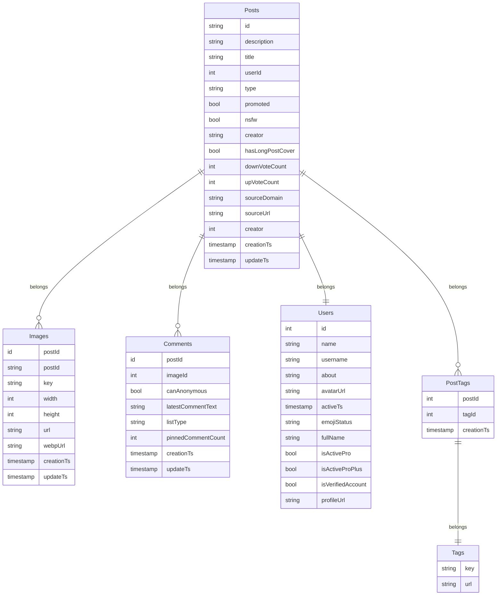
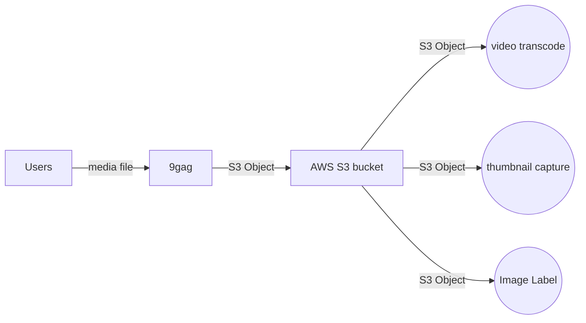
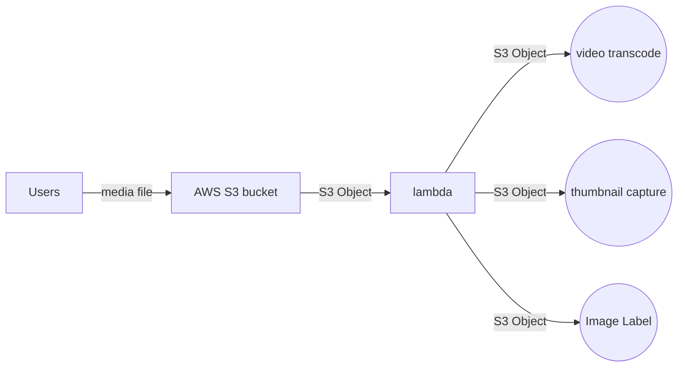

# Project 1

> **1. Propose a solution and an estimation on the timeline to implement this feature, given
   the limitations, to maximize productivity, scalability and maintainability.**

In ordre to build a new feature on top of a legency system, we should prevent to make lot of code changes on it. So my solution will minimilize the code change in both `comment` and `post` modules in **9gag** system.

The direction of this solution is to put a message queue behind `comment` microservice, detail step as following:
1. Update DB schema by adding `originalPostId` in `posts` table.
2. Update create post API
   for `POST 'https://9gag.com/submit'` , we need to add new params `originalPostId` , which indicate the post is a repost from other post, and store `originalPostId` value in `posts` tables, here is a example.
   
````
   curl 'https://9gag.com/submit' \
  -H 'authority: 9gag.com' \
  -H 'accept: */*' \
  -H 'accept-language: en-US,en;q=0.9' \
  -H 'content-type: application/json' \
  -H 'cookie: ${cookie with session info}' \
  ...
  --data-raw '{"title":"bearbrick","originalPostId":"a2KKZKE", "tags":"BEARBRICK","nsfw":0,"isAnonymous":0,"uploadId":"10279791_1676215713865_2193","type":"photo"}' \
  --compressed
````

3. Add message queue (SQS/Kafka) behind `comment` microservice
   
   Every time user post a comment to comment microservice, it will fire a event to the MQ we created in step 1.
   message body should include the cookie from the users. There are lot of MQ solution but i will suggest `SQS` or `Kafka`, because both of them is easy to setup and have a relatively high thoughput compare to `rabbitMQ` and `redisMQ`

4. Setup AWS lambda to trigger post API
   
   Once event fired to the MQ, the AWS lambda will read the event from the message queue, and then it trigger the create post API from the lambda. Please remember to add a new argument `originalPostId` and include the `session` info in cookies.

   Cause it is a async action for lambda to trigger create post, so we can control the outflow for MQ by create serveral number of lambda function.

   *Remark: of course AWS lambda is not a must, we can also deploy our own EKS service the handle this process and scale it with `helm` *
   
5. After we trigger the existing API for post, the legency logic should work properly including trigger notification and sync data to elastic search.
   

After studying the `post` data and `comment` API from **9gag**, my suggestion for the feature is to add a separate async message queue after comment module in 9gag backend to implement `repost` feature.
The implementation step as following:
6. add a new `repost` when user call `POST /v2/add-comment.json`, default is `false`.
```
curl 'https://comment.9gag.com/v2/add-comment.json' \
  -H 'authority: comment.9gag.com' \
  -H 'accept: */*' \
  -H 'accept-language: en-US,en;q=0.9' \
  -H 'content-type: application/x-www-form-urlencoded' \
  -H 'origin: https://9gag.com' \
  -H 'referer: https://9gag.com/' \
  ...
  --data-raw 'appId=${appId}&url=${url}&auth=${auth}&repost=true&text=cool&opToken=${token_here}' \
  --compressed
```   

1. update DB schema
   
   After studying the API endpoint from **9gag**, i assume the mysql db schema should be as following


And the only DB changes should be add a `originalPostId` in `posts` table
```mermaid
erDiagram
   
   Posts {
      string id
      string originalPostId
      string description
      string title
      int userId
      string type
      bool promoted
      bool nsfw
      string creator
      bool hasLongPostCover
      int downVoteCount
      int upVoteCount
      string sourceDomain
      string sourceUrl
      int creator
      timestamp creationTs
      timestamp updateTs
   }
````
## Timeline
Here is my rough estimation for this feature
* UI/UX Design 1 weeks
* Backend Development 2-3 weeks
  * db migration file preparation.
  * API changes for new params.
  * create new message queue / lambda
  * CI/CD setup for new service including (SQS/Kafka) message queue and lamdba worker
  * helm file preparation for autation CD
  
* Frontend Development 2 weeks
  * new Post interface with `repost` feature
  * new comment widget with option for `repost`
* IOS Development 2 weeks
  * new Post interface with `repost` feature
  * new comment widget with option for `repost`
* Android Development 2 weeks
  * new Post interface with `repost` feature
  * new comment widget with option for `repost`
* Testing and Debugging 1 weeks
  * QA testing for feature 
  * Debug both frontend and backend that raise during testing
  * Execute some load test in staging enviornment and compare the difference between old version and new version.
* UAT Testing 1 weeks
  * Let Product Owner have a final check 
  * can be parallet with QA testing 
* Deployment 1 weeks
  * Deploy new feature to pre-production environment and see may missing for deployment step
  * Then deploy to production environment and monitor the feature to ensure it work as expected.
  * Also monitor the any performance issue for production DB and `memcache`.
  

```mermaid
   gantt
   dateFormat  YYYY-MM-DD
   title overview timeline

   section Product Design
   PRD Preparation                     :active,    prd, 2023-01-01, 5d
   Comment widget design               :active,    des2, 2023-01-01, 3d
   Post widget design                  :active,    des3, after des2, 3d
   Mobile design                       :active,    mobile_design, after des3, 3d

   section Backend
   DB Migration                        :active, db, after prd, 24h
   POST/Comment API Changes            :active, api, after db, 2d
   create message queue / lambda       :active, createqueue, after api, 3d
   Deploy Lambda                       :active, worker, after createqueue, 2d
   Test Case                           :active, testcase, after worker, 3d
   CI/CD setup                         :active, active, after testcase, 2d
   helm file prepare                   :active, :2d

   section Frontend
   Re-Post interface                   :active, a1, after mobile_design, 3d
   comment widget                      :active, comment, after a1 , 3d
   integration                         :active, integration, after comment, 3d
   
   section iOS
   Re-Post interface                   :active, a1, after mobile_design, 3d
   comment widget                      :active, comment, after a1  , 3d
   integration                         :active, integration, after comment, 3d

   section Android
   Re-Post interface                   :active, a1, after mobile_design, 3d
   comment widget                      :active, comment, after a1  , 3d
   integration                         :active, integration, after comment, 3d
   

   section QA
   Feature Testing                     :active, qa,after integration, 1w
   Bug fix                             :active, qa,after integration, 1w
   UAT                                 :active, qa,after integration, 1w

   

   section Deployment
   deploy to preproduction             :active, preprod, after qa, 3d
   deploy to production                :active, prod ,after preprod, 3d
```

> ## 2. What SDLC methodology do you prefer and fit our needs? What steps will you take to do better during the complete development cycle?

There are several SDLC methodology can ensure the project complete, but i think Agile methodology is well-suited for 9gag, cause Agile have the flexibiliity, quick adaptation to changes and also continuous improvement, which is very effective to a medium to small team to move fast and delivering high-quality feature in a timely manner.

To ensure a successful development cycle, the following steps can be taken:
1. Define requirements in planning phase.
2. Hold daily stand-up meetings to discuss progress and identify any blocker.
3. Continously review the code to ensure the code is clean, man scalable.
4. Introduce unit test during development process, to ensure the code work as expect during CI/CD process.
5. Hold retrospective after each sprint to improve the development process. It will help the dev team to working as efficiently as possible.


> ## 3. Should we or how could we rebuild/revitalize 9GAG's legacy system while developing new features across all platforms at the same time?

Before we decide wehter to rebuild or reviatlize legacy system, we should first assess the current system to determine what needs to be updated or rebuild and what benefit will bring to 9gag after rebuild. These benefits many be improving the performance, reducing the cost.

After assessing the system diagram and my experience when i using **9gag**, the first thing i would suggest to improve is the way user upload media(both images and videos) to 9gag. For current situation, the media file is upload to 9gag backend API, then **9gag** process the video transcode and capture video thumbnail tasks async. Cause the file is upload to **9gag** backend, so it will consume the network bandwidth of **9gag** cloud service and the user experience may affect during high traffic period.

Assuming the currect data flow as following, 

New approcach will be as following, users will upload media file though `AWS S3 SDK` and the file will go to bucket directly, and you can setup the event source from S3 and trigger lambda to process video transcode and image label etc.:




Secondly, understand that most 9gag backend is build by PHP 8.0, which is a simple and easy to pick up language. Although PHP 8.0 is quite a new version and this should be good from security perspective, but unable to take advantage to `multithread` and `non-blocking` which may affect the system performance and cost. So would suggest to revamp `notification` or `vpvote`/`downvote` microservice, cause these 3 feature should be the most high traffic service in **9gag** backend. In order to provide better solution, I need to have a more detail context about the architecture design and the bottleneck on current arch, rather than just rewrite the microservice from **PHP** to other programming language.