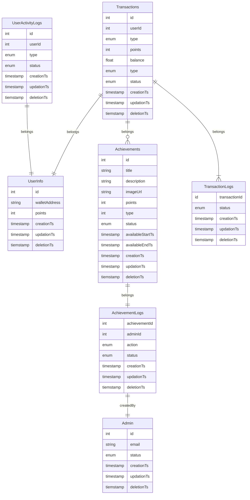
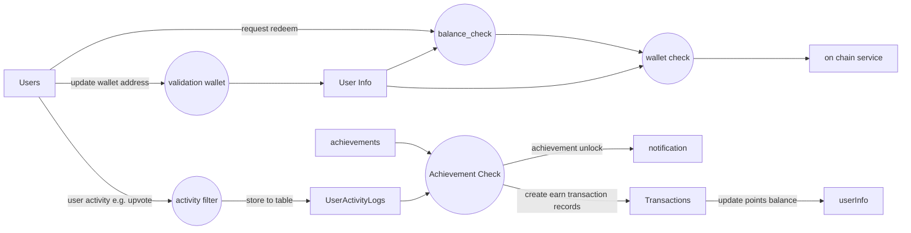

# Project 2

> **1. Design the database schema**

In order to create a loyality system for **9gag** , here is the list of table going to create

| Table Name       | Description                                                                                             |     |
| ---------------- | ------------------------------------------------------------------------------------------------------- | --- |
| Achievements     | store all achievements in loyality system                                                               |     |
| Transactions     | store all user point transaction including earn and redeem                                              |     |
| UserInfo         | store user info including wallet address and point balance                                              |     |
| UserActivityLogs | store all user activity including comment, upvote, create post, share etc                               |     |
| TransactionLogs  | store every transaction status including transaction requested, processing status, complete status etc. |     |
| AchievementLogs  | store all admin action on create / update / delete achievements for loggins purpose                     |     |
| Admin            | store admin users information                                                                           |     |

Here is the ER diagram for different tables.




> **2. Illustrate the data flow**



> **3. Design the APIs endpoints**

Due the the API design practise in 9gag is RESTful API, so i will have the following new endpoint design. These API list only included external API, for those internal API (e.g. create achievemnt/ update daily achievement) is not included

| Title                       | API Endpoint     | Method | URL params                                                     | Description                                                                  |
| --------------------------- | ---------------- | ------ | -------------------------------------------------------------- | ---------------------------------------------------------------------------- |
| Get all achieveemnts,       | /achievements    | GET    | type: filter by type<br/>page: default 0<br/>limit: default 20 | Get all achievements, can filter by type URL params, also support pagination |
| Get my transactions         | /my/transactions | GET    | page: default 0 <br> limit: default 20                         | Let all transactions for every point you earn and redeemp                    |
| get my reward point balance | /my/balance      | GET    | N/A                                                            | Get the total balance for reward points you have                             |
| update my MetaMask wallet   | /my/wallet       | PUT    | N/A                                                            | Update you wallet address for redeem you point to MetaMask wallet            |
| redeem my point             | /my/point/redeem | PUT    | N/A                                                            | users to redeem the points and send back MetaMask Wallet                     |

Here is the example for API `request` and `response`

### Get all achievements

```
GET /achievements?type=upvote,comment,post&page=0&limit=20
HTTP 200 OK
{
    data: {
        achievements[
            {
                id: "InM63b4gS5",
                name: "share rewards",
                type: "share",
                redeemed: true,
                creationTs: 1676109493
            },
            {
                id: "cH9J6wM5qt",
                name: "Vpvote rewards",
                type: "upvote",
                redeemed: false,
                creationTs: 1676109493
            },
            {
                id: "tRoOaRAsCk",
                name: "comment rewards",
                type: "comment",
                redeemed: false,
                creationTs: 1676109493
            }
        ]
    },
    meta: {
        sid: '9gVQ01EVjlHTUVkMMRVS4xEVFpXTn1TY',
        status: 'Success',
        timestamp: 1676109493
    }
}
```

### Get point transactions history

```

GET /my/transactions?limit=25&page=0
HTTP 200 OK
{
    data: {
        transaction: [
          {
             type: 'earn',
             points: 30,
             status: 'success',
             achievement: {
                id: "cH9J6wM5qt",
                name: "Vpvote rewards",
                type: "upvote",
                redeemed: true,
                creationTs: 1676109493
             },
             creationTs: 1676109316,
          },
          {
             type: 'earn',
             points: 30,
             status: 'success',
             achievement: {
                id: "tRoOaRAsCk",
                name: "comment rewards",
                type: "comment",
                redeemed: false,
                creationTs: 1676109493
             },
             creationTs: 1676109316,
          },
          {
             type: 'redeem',
             points: 30,
             status: 'success',
             creationTs: 1676109316
          },
        ]
    },
    meta: {
        sid: '9gVQ01EVjlHTUVkMMRVS4xEVFpXTn1TY',
        status: 'Success',
        timestamp: 1676109493
    }
}
```

### Get my reward point balance

```
GET /my/balance
HTTP 200 OK
{
    data {
        balance: {
            points : 300,
        }
    },
    meta: {
        sid: '9gVQ01EVjlHTUVkMMRVS4xEVFpXTn1TY',
        status: 'Success',
        timestamp: 1676109493
    }
}
```

### Update my MetaMask wallet

```

PUT /my/wallet
    -d '{"walletAddress": "0xb08B7cCB09DAc236DB60b621A0E5eAddA8191A10"}'
HTTP 200 OK
{
    data: {
        userInfo: {
            reqeustId: "kuWqkbm47f",
            walletAddress: "0xb08B7cCB09DAc236DB60b621A0E5eAddA8191A10"
        }
    },
    meta: {
        sid: '9gVQ01EVjlHTUVkMMRVS4xEVFpXTn1TY',
        status: 'Success',
        timestamp: 1676109493
    }
}
```

### redeem my point

```
PUT /my/points/redeem
    -d '{"points": 300}'
HTTP 200 OK
{
    data: {
        redeem: {
            id: "78QFEtttlo",
            creationTs: 1676109493
        }
    },
    meta: {
        sid: '9gVQ01EVjlHTUVkMMRVS4xEVFpXTn1TY',
        status: 'Success',
        timestamp: 1676109493
    }
}
```

> **4. Any considerations you can think of**

First of all, these DB/API design and implementation is a very basic loyality system without member tier concept, so every user can earn point and redeem every rewards avaiable in that period. If we need a tier concept in this loyality system, we should have a extra column `tier` in both `UserInfos` and `Rewards` table which only same tier user can retieve that rewards.

Secondly, in API design section, you can see the update wallet API is super simple and the hacker may easily reteive the cookie from other user browser and trigger update wallet and redeem the point the hacker wallet. So we should also implement `2FA` or `MFA` protection when user try to request update wallet address and redeem to point and send back to MetaMask wallet.

Also, cause this use case invoice on-chain action, there are async operation and always have error during on-chain action ( e.g. Transaction rejected, Request limit exceeded... etc.), so our on-chain module should handle the fail case, including retry logic or point refund logic when error happen.
